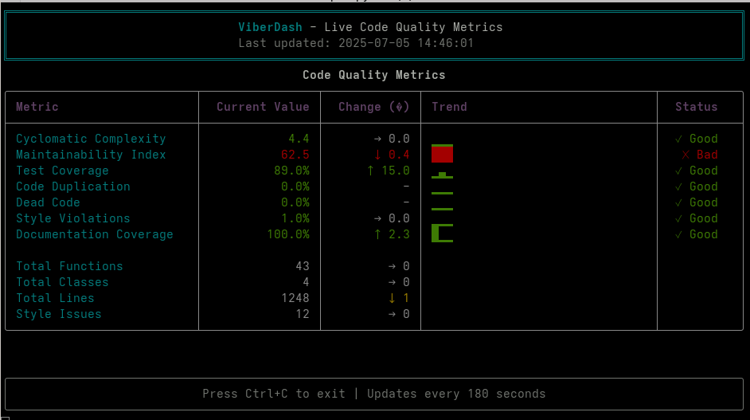

# 🤖📊 ViberDash

A real-time terminal dashboard for monitoring Python code quality metrics. ViberDash continuously analyzes your codebase and displays key metrics in a beautiful, auto-updating terminal interface.



[](https://github.com/johannhartmann/viberdash)
[](https://www.python.org/)
[](LICENSE)
[](https://github.com/psf/black)

## Features

- **Real-time Monitoring**: Automatically scans your code every 180 seconds (3 minutes)
- **Live Test Coverage**: Runs your test suite on each scan to provide real-time coverage metrics
- **Rich Terminal UI**: Beautiful, color-coded metrics display using Rich
- **Comprehensive Metrics**:
  - Cyclomatic Complexity (Radon)
  - Maintainability Index (Radon)
  - Test Coverage (Pytest + Coverage.py) - **runs tests live!**
  - Code Duplication (Radon)
  - Dead Code Detection (Vulture)
  - Style Violations (Ruff)
  - Documentation Coverage (Ruff docstring checks)
- **Historical Tracking**: SQLite-based storage with trend visualization
- **Configurable Thresholds**: Customize what constitutes "good" or "bad" metrics
- **Sparkline Trends**: Visual representation of metric changes over time
- **No Static Files**: Coverage is calculated fresh on each scan, not read from outdated files

## Installation

### Quick Install with Nix

If you're using Nix, you can install ViberDash directly:

```bash
# Install to your profile
nix profile install github:johannhartmann/viberdash

# Or run without installing
nix run github:johannhartmann/viberdash
```

### Install with UV (Recommended)

```bash
# Install with UV
uv pip install viberdash

# Or install directly from GitHub
uv pip install git+https://github.com/johannhartmann/viberdash.git
```

### Install with pip

```bash
# Install from PyPI
pip install viberdash

# Or install from GitHub
pip install git+https://github.com/johannhartmann/viberdash.git
```

### Development Installation

For development or to run from source:

```bash
# Clone the repository
git clone https://github.com/johannhartmann/viberdash.git
cd viberdash

# Using Nix (recommended for development - includes all tools)
nix develop
python -m viberdash.vibescan

# Or using UV (for testing end-user experience)
uv venv
source .venv/bin/activate  # On Unix/macOS
uv pip install -e ".[dev]"

# Or using pip
python -m venv .venv
source .venv/bin/activate
pip install -e ".[dev]"
```

## Usage

⚠️ **Important**: ViberDash now uses a command-based interface. The main command is `monitor`:

### Basic Usage

```bash
# Monitor the current directory
viberdash monitor

# Monitor a specific directory
viberdash monitor --source-dir /path/to/your/project

# Set custom update interval (default: 180 seconds)
viberdash monitor --interval 30

# Use a specific config file
viberdash monitor --config /path/to/pyproject.toml
```

### Command Line Options

```
Commands:
  monitor  Start the real-time monitoring dashboard
  test     Run external tests for a project

Monitor Options:
  -s, --source-dir PATH  Source directory to analyze
  -i, --interval INT     Update interval in seconds (default: 180)
  -c, --config PATH      Path to configuration file (default: pyproject.toml)
  --help                 Show this message and exit
```

## Configuring Your Python Project for ViberDash

ViberDash can monitor any Python project. Here's how to configure your application:

### 1. Basic Setup

Add ViberDash configuration to your project's `pyproject.toml`:

```toml
[tool.viberdash]
# Directory to analyze (relative to project root)
# If not specified, defaults to current directory
source_dir = "src/"  # or "mypackage/" or wherever your Python code is

# Optional: Custom metric thresholds
[tool.viberdash.thresholds.cyclomatic_complexity]
good = 5.0      # Below this = green
bad = 10.0      # Above this = red

[tool.viberdash.thresholds.maintainability_index]
good = 85.0     # Above this = green
bad = 65.0      # Below this = red

[tool.viberdash.thresholds.test_coverage]
good = 80.0     # Above this = green
bad = 60.0      # Below this = red

[tool.viberdash.thresholds.code_duplication]
good = 5.0      # Below this = green
bad = 15.0      # Above this = red

[tool.viberdash.thresholds.dead_code]
good = 5.0      # Below this = green
bad = 15.0      # Above this = red

[tool.viberdash.thresholds.style_violations]
good = 10.0     # Below this = green
bad = 25.0      # Above this = red

[tool.viberdash.thresholds.doc_coverage]
good = 80.0     # Above this = green
bad = 60.0      # Below this = red
```

### 2. Project Requirements

For ViberDash to work properly, your project should have:

- **Tests using pytest**: ViberDash runs `pytest` to calculate live coverage
- **A test directory**: Usually `tests/` with test files
- **Python 3.12+**: Required for ViberDash itself

⚠️ **Critical for Test Coverage**: To enable ViberDash to run your tests and calculate coverage, you must install ViberDash and its dependencies in your project's development environment:

```toml
# In your project's pyproject.toml
[project.optional-dependencies]
dev = [
    "viberdash",  # Add this to enable test coverage monitoring
    # your other dev dependencies...
]

# Or if using [tool.uv]
[tool.uv]
dev-dependencies = [
    "viberdash",  # Add this to enable test coverage monitoring
    # your other dev dependencies...
]
```

Then install with dev dependencies:
```bash
# Using pip
pip install -e ".[dev]"

# Or using uv
uv pip install -e ".[dev]"
```

This ensures that when ViberDash runs `pytest` in your project directory, all necessary dependencies are available.

### 3. Running ViberDash

From your project root:

```bash
# If pyproject.toml has [tool.viberdash] config
viberdash monitor

# Or specify the source directory explicitly
viberdash monitor --source-dir src/

# Or from anywhere, pointing to your project
viberdash monitor --source-dir /path/to/project/src/
```

### 4. Example Configurations

#### Django Project
```toml
[tool.viberdash]
source_dir = "myapp/"  # Your Django app directory

[tool.viberdash.thresholds.test_coverage]
good = 90.0  # Django projects often aim for high coverage
bad = 75.0
```

#### FastAPI Project
```toml
[tool.viberdash]
source_dir = "app/"  # Common FastAPI structure

[tool.viberdash.thresholds.maintainability_index]
good = 80.0  # API endpoints can be complex
bad = 60.0
```

#### Data Science Project
```toml
[tool.viberdash]
source_dir = "src/"

[tool.viberdash.thresholds.cyclomatic_complexity]
good = 10.0  # Data processing can be complex
bad = 20.0

[tool.viberdash.thresholds.doc_coverage]
good = 90.0  # Documentation is crucial for data science
bad = 70.0
```

### 5. Handling False Positives

If ViberDash reports dead code that isn't actually dead (e.g., dynamic imports, entry points), create a `.vulture_whitelist` file:

```python
# .vulture_whitelist
_.my_dynamic_function  # Function called dynamically
_.MyClass.method      # Method used via getattr
_.api_endpoint        # FastAPI/Flask routes
```

### 6. Optimizing for Live Monitoring

Since ViberDash runs tests every scan interval (default: 180 seconds):

- **Keep tests fast**: Aim for < 2 minutes total runtime
- **Use pytest markers**: Run only unit tests if needed
- **Adjust interval**: Use `--interval 300` for slower test suites

```toml
# If you want ViberDash to run only fast tests
[tool.pytest.ini_options]
markers = [
    "slow: marks tests as slow",
    "fast: marks tests as fast",
]
```

Then tag your tests:
```python
@pytest.mark.fast
def test_quick_function():
    pass

@pytest.mark.slow
def test_integration():
    pass
```

### 7. Tips for Effective Monitoring

- **Run in a dedicated terminal**: Keep ViberDash visible while coding
- **Watch the trends**: Sparklines show if metrics are improving or degrading
- **Act on red metrics**: Address issues as they appear in real-time
- **Adjust thresholds**: Customize based on your project's needs and standards

## Real-time Test Coverage

ViberDash's standout feature is its **live test coverage analysis**. Unlike other tools that read stale `coverage.json` files, ViberDash:

- **Runs your full test suite** on each scan (every 3 minutes by default)
- **Calculates fresh coverage** by parsing pytest's terminal output directly
- **Shows real coverage changes** as you add/remove tests or modify code
- **Provides truly real-time feedback** on how your changes affect test coverage

This means you can:
- Watch your coverage improve as you add tests
- See coverage drop immediately when you add untested code
- Get accurate coverage metrics without manually running tests
- Trust that the coverage displayed is current, not from hours or days ago

⚠️ **Note**: Since ViberDash runs your full test suite on each scan, make sure your tests run reasonably fast (under 2 minutes recommended). You can adjust the scan interval with `--interval` if needed.

## Architecture

ViberDash consists of four main components:

1. **`vibescan.py`** - Main orchestrator that runs the continuous monitoring loop (default: 180s)
2. **`analyzer.py`** - Executes code analysis tools and runs live test coverage
3. **`storage.py`** - SQLite-based persistence for historical data and trends
4. **`tui.py`** - Rich-based terminal UI with live updates and sparkline trends

### Data Flow

```
[Configuration] → [Main Loop] → [Analyzer] → [Storage]
                      ↑             ↓             ↓
                      └─ [Terminal UI] ←─────────┘
                                    ↓
[Pytest + Coverage] ←─ [Live Test Execution]
```

On each scan cycle, ViberDash:
1. Runs static analysis tools (radon, vulture, ruff)
2. Executes your full test suite with coverage
3. Stores results in SQLite database
4. Updates the terminal display with trends and sparklines

## Development

### Running Tests

```bash
# Run tests with coverage
pytest --cov=viberdash

# Watch mode for development
pytest-watch
```

### Code Quality

```bash
# Format code
black viberdash/ tests/

# Lint code
ruff check viberdash/ tests/

# Type checking
mypy viberdash/
```

### Contributing

1. Fork the repository
2. Create a feature branch (`git checkout -b feature/amazing-feature`)
3. Commit your changes (`git commit -m 'Add amazing feature'`)
4. Push to the branch (`git push origin feature/amazing-feature`)
5. Open a Pull Request

## Requirements

- Python 3.12+
- Unix-like environment (Linux, macOS, WSL)
- Terminal with color support

## License

This project is licensed under the MIT License - see the [LICENSE](LICENSE) file for details.

## Acknowledgments

- Built with [Rich](https://github.com/Textualize/rich) for beautiful terminal output
- Uses [Radon](https://radon.readthedocs.io/) for complexity metrics
- Powered by [UV](https://github.com/astral-sh/uv) for fast Python package management
